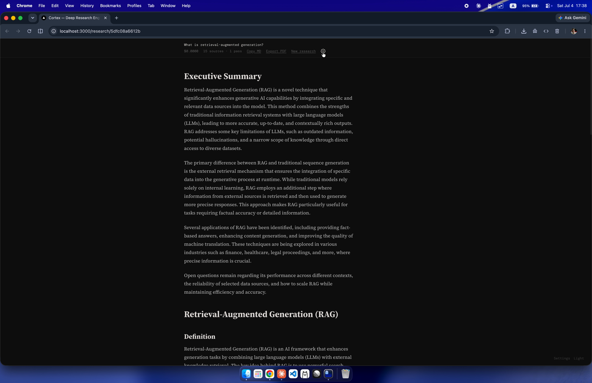
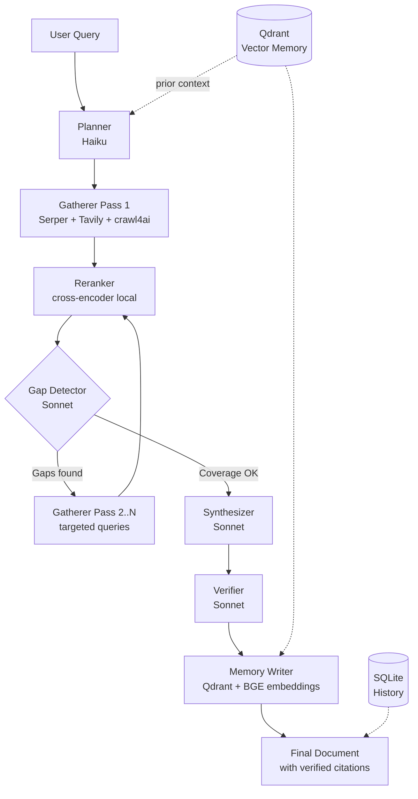

# Cortex


> **Status:** Archived. This project explored multi-pass research agents and is no longer actively developed. See the [retrospective post](./docs/retrospective.md) for what I learned and why I moved on.

Multi-layer research engine with cumulative memory and cost-efficient model routing.

Search -> find gaps -> search again -> verify every claim -> remember everything for next time.

## Screenshots




## What Makes It Different

| Feature | Standard AI Search | Cortex |
|---------|-------------------|--------|
| Search depth | Single pass | Up to 3 iterative passes |
| Gap detection | No | Automatic coverage scoring + targeted follow-up |
| Claim verification | No | Every citation checked against its source |
| Memory | No | Qdrant vector DB recalls prior research |
| Cost control | Opaque | Model routing: Haiku for planning, Sonnet for synthesis |
| Source transparency | Partial | Full inline citations with verification verdicts |
| Self-hosted | No | Yes, fully open-source |

## Architecture



## Cortex-D: Disaggregated Inference

Cortex-D is an optional inference layer that routes each pipeline stage to a specialized worker tier, in the style of NVIDIA Dynamo's prefill/decode split. The idea is that stages are not uniform: planning and gap detection are prefill-heavy — large inputs, short JSON outputs — while synthesis and verification are decode-heavy — moderate inputs, long document outputs. Sending both through one endpoint wastes GPU time; routing by stage characteristics lets each tier run on hardware and a model sized for its workload.

| Worker Type | Pipeline Stages | Characteristics |
|-------------|-----------------|-----------------|
| **Prefill** | planning, gap_detection | Large input, short JSON output |
| **Decode** | synthesis, verification | Moderate input, long document output |

Real-Dynamo mode requires GPU hardware with NVIDIA Dynamo workers running on the prefill and decode endpoints. In this codebase it was validated primarily in mock mode, which routes through the same dispatcher but delegates actual inference back to Anthropic — useful for exercising the routing logic and measuring overhead without a GPU.

See [`dynamo/README.md`](./dynamo/README.md) for full setup details and environment variables.

## Quick Start

### 1. Clone and configure

```bash
git clone https://github.com/aleks-gotsa/cortex.git
cd cortex
cp .env.example .env
```

Edit `.env` with your API keys:

```
ANTHROPIC_API_KEY=sk-ant-...
SERPER_API_KEY=...
TAVILY_API_KEY=...         # optional — Serper alone works fine
```

### 2. Start Qdrant (vector memory)

```bash
docker-compose up -d
```

### Python version

This project requires Python 3.12. If you have pyenv:

```bash
pyenv install 3.12.7
pyenv local 3.12.7
```

### 3. Install and run backend

```bash
pip install -r requirements.txt
python -m playwright install chromium   # for crawl4ai scraping
uvicorn backend.main:app --reload --port 8000
```

### 4. Install and run frontend

```bash
cd frontend
npm install
npm run dev
```

Open http://localhost:3000

## Usage

### Via the web UI

1. Enter a research query
2. Select depth: **quick** (1 pass), **standard** (2 passes), or **deep** (3 passes)
3. Watch real-time progress as each pipeline stage completes
4. Read the verified document with inline citations
5. Browse past research in the sidebar

### Via curl

```bash
# Stream a research session
curl -N -X POST http://localhost:8000/research \
  -H "Content-Type: application/json" \
  -d '{"query": "What is retrieval augmented generation?", "depth": "quick"}'

# Get research history
curl http://localhost:8000/research/history

# Get a specific result
curl http://localhost:8000/research/{research_id}
```

## CLI

Run research from your terminal:

```bash
pip install -e .
cortex "What is retrieval-augmented generation?"
cortex --depth deep "How do transformers work?"
cortex history
cortex view <research_id>
```

Or launch the interactive REPL:

```bash
cortex
```

## API

| Method | Path | Description |
|--------|------|-------------|
| `POST` | `/research` | Start research, returns SSE stream |
| `GET` | `/research/history` | List past research runs |
| `GET` | `/research/{id}` | Get full result by ID |

### SSE Events

The `/research` endpoint streams these events in order:

| Event | Data |
|-------|------|
| `planning` | sub_questions, strategy |
| `gathering` | pass number, sources_found, queries_used |
| `gap_detection` | coverage scores, gaps (skipped for `quick`) |
| `synthesizing` | — |
| `verifying` | confirmed, weakened, removed counts |
| `memory` | chunks_stored, collection |
| `complete` | document, sources, cost_usd, research_id |

## Stack

| Layer | Technology |
|-------|-----------|
| Backend | FastAPI, Python 3.12+, async everywhere |
| LLM | Anthropic Claude (Haiku for planning, Sonnet for synthesis/verification) |
| Search | Serper.dev + Tavily Search API |
| Scraping | crawl4ai (Playwright-based, JS rendering) |
| Reranking | cross-encoder/ms-marco-MiniLM-L-6-v2 (local) |
| Embeddings | BAAI/bge-small-en-v1.5 (local) |
| Vector DB | Qdrant (Docker) |
| Storage | SQLite via aiosqlite |
| Frontend | Next.js 14, TypeScript, Tailwind CSS |
| Streaming | Server-Sent Events (SSE) |

## Cost Estimates

| Depth | Passes | Typical Cost | Time |
|-------|--------|-------------|------|
| Quick | 1 | ~$0.08-0.15 | ~30s |
| Standard | 2 | ~$0.15-0.25 | ~60s |
| Deep | 3 | ~$0.25-0.40 | ~90s |

Costs depend on query complexity and source volume. Haiku handles planning at 1/4 the cost of Sonnet.

## Limitations

- No test suite — this was a research exploration, not production code
- Verification pass can produce false positives on ambiguous or context-dependent claims
- Cost estimates are rough and vary significantly with query complexity and source volume
- Cortex-D real-Dynamo mode was tested in mock only; real-hardware end-to-end validation was not completed
- Gap detector's 0.6 coverage threshold is heuristic and not tuned against a reference dataset

## What I Learned

- Verification pass catches more hallucinations than additional search passes prevent — rigor at synthesis time beats volume at gather time
- Multi-model routing (Haiku/Sonnet) cuts cost 3-4x with no measurable quality loss on typical queries
- Multi-pass latency compounds: even fast individual passes produce slow end-to-end UX, which is why I stopped using Cortex myself
- Cross-session memory is more useful as an explicit recall tool than as automatic pipeline input
- Deep research as a product category demands a waiting-page UX that conflicts with mobile-first quick-lookup usage

## Project Structure

```
cortex/
├── backend/
│   ├── main.py              # FastAPI app, SSE endpoint
│   ├── config.py            # Settings from .env
│   ├── models.py            # Pydantic schemas
│   ├── pipeline/
│   │   ├── orchestrator.py  # Full pipeline coordination
│   │   ├── planner.py       # Query decomposition (Haiku)
│   │   ├── gatherer.py      # Search + scrape + rerank
│   │   ├── gap_detector.py  # Coverage evaluation (Sonnet)
│   │   ├── synthesizer.py   # Document generation (Sonnet)
│   │   ├── verifier.py      # Claim verification (Sonnet)
│   │   └── memory.py        # Qdrant read/write
│   ├── search/
│   │   ├── serper.py        # Serper.dev client
│   │   ├── tavily.py        # Tavily Search client
│   │   └── scraper.py       # crawl4ai wrapper
│   ├── llm/
│   │   ├── client.py        # Anthropic SDK wrapper
│   │   └── router.py        # Model selection + cost tracking
│   └── storage/
│       └── db.py            # SQLite persistence
├── cli/
│   ├── cortex_cli.py        # CLI entrypoint, REPL, commands
│   ├── connection.py        # SSE stream client
│   ├── progress.py          # Live stage progress display
│   ├── output.py            # File saving and stats footer
│   └── renderer.py          # Terminal markdown renderer
├── frontend/
│   ├── app/                 # Next.js App Router
│   └── components/
│       ├── SearchInput.tsx       # Query field + depth selector
│       ├── PipelineProgress.tsx  # Real-time SSE progress display
│       ├── ResearchDocument.tsx  # Rendered markdown with citations
│       └── HistoryList.tsx       # Past researches sidebar
├── docker-compose.yml       # Qdrant service
├── requirements.txt
└── .env.example
```

## MCP Server

Use Cortex as a tool from Claude Desktop, claude.ai, or any MCP client.

### Run

```bash
python mcp_server.py
# or
fastmcp run mcp_server.py
```

### Claude Desktop config

Add to `~/Library/Application Support/Claude/claude_desktop_config.json`:

```json
{
  "mcpServers": {
    "cortex": {
      "command": "python",
      "args": ["mcp_server.py"],
      "cwd": "/absolute/path/to/cortex"
    }
  }
}
```

### Available tools

| Tool | Description | Params |
|------|-------------|--------|
| `research` | Run full research pipeline (30-90s) | `query` (str), `depth` ("quick"\|"standard"\|"deep"), `use_memory` (bool) |
| `recall` | Search Qdrant memory for prior research | `query` (str), `top_k` (int) |
| `history` | List past research runs | `limit` (int) |
| `get_research` | Retrieve a specific past result | `research_id` (str) |

## License

MIT
