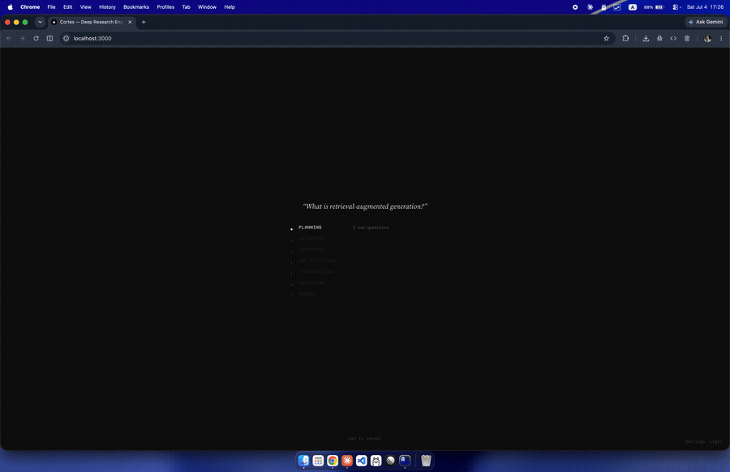
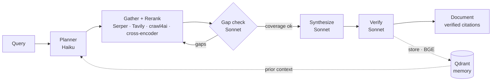

# Cortex


Cortex is a multi-pass research pipeline: plan, gather, gap-check, synthesize, verify, store. Development ended April 2026; the evaluation, test suite, and local backend were added in July 2026 to close it out.

- Up to 3 iterative search passes, with coverage scoring and targeted follow-up between passes.
- Every cited claim is checked against its source content; verdicts ship inline with the document.
- Cross-session Qdrant memory recalls prior research; model routing sends bounded stages to Haiku, synthesis and verification to Sonnet. Self-hosted, MIT-licensed.

## Status

Development ended 2026-04-22. The evaluation harness, test suite, and local (Ollama) backend were added in July 2026 as an archival close-out, not new features. It ended for four reasons:

- Multi-pass latency compounds: even fast individual passes sum to slow end-to-end UX.
- The author stopped reaching for the tool for real research.
- Automatic memory recall biased planning toward earlier results.
- The waiting-page UX that deep research needs conflicts with mobile-first quick lookups.

## Screenshots




*Recorded fully local on a MacBook Air (M4) — zero API calls. Note the `$0.0000` cost on the finished document.*

## Architecture



## Configurations

Selected by `LLM_BACKEND`.

**Reference (Claude API)** — the default (`LLM_BACKEND=anthropic`) and the config the project was built in: Haiku plans; Sonnet handles gap detection, synthesis, and verification. Bring your own key.

**Local (OpenAI-compatible / Ollama)** — no API keys for inference; every LLM call is served locally. The committed evaluations ([`docs/evaluation.md`](./docs/evaluation.md)) were run and the demo recorded here.

```bash
ollama pull llama3.2:3b          # planning + gap detection
ollama pull qwen2.5:7b-instruct  # synthesis + verification
ollama pull llama3.1:8b          # eval judge only
export LLM_BACKEND=local
```

Added at archival time to make the evaluation reproducible and the demo free to run; the project was developed Claude-first. It dropped in behind the existing `get_llm_client()` / `LLMClientBase` seam in ~200 lines, without touching the pipeline.

## Cortex-D: disaggregated inference

Optional inference layer that routes each stage to a worker tier, after NVIDIA Dynamo's prefill/decode split: planning and gap detection are prefill-heavy (large input, short JSON), synthesis and verification are decode-heavy (moderate input, long output). Routing by stage lets each tier size its own hardware and model.

| Worker | Stages | Profile |
|--------|--------|---------|
| **Prefill** | planning, gap_detection | Large input, short JSON output |
| **Decode** | synthesis, verification | Moderate input, long document output |

Validated primarily in mock mode, which uses the same dispatcher but delegates inference to Anthropic; real mode needs GPU hosts running NVIDIA Dynamo workers. See [`dynamo/README.md`](./dynamo/README.md).

## Run

Requires Python 3.12, Docker (Qdrant), and Node (frontend).

```bash
git clone https://github.com/aleks-gotsa/cortex.git && cd cortex
cp .env.example .env    # ANTHROPIC_API_KEY, SERPER_API_KEY; TAVILY_API_KEY optional
docker-compose up -d    # Qdrant vector memory
pip install -r requirements.txt && python -m playwright install chromium
uvicorn backend.main:app --reload --port 8000
cd frontend && npm install && npm run dev   # http://localhost:3000
```

```bash
curl -N -X POST http://localhost:8000/research -H "Content-Type: application/json" \
  -d '{"query": "What is retrieval augmented generation?", "depth": "quick"}'
```

Deploy with the included `render.yaml` (backend, Render) and `vercel.json` (frontend, Vercel) — one per service, not both for the same component.

## Interfaces

**CLI** — `pip install -e .`, then `cortex "your question"` or `cortex --depth deep "..."`; also `cortex history`, `cortex view <id>`, and bare `cortex` for the REPL.

**API**

| Method | Path | Description |
|--------|------|-------------|
| `POST` | `/research` | Start research, returns an SSE stream |
| `GET` | `/research/history` | List past runs |
| `GET` | `/research/{id}` | Get a full result by ID |

**SSE** — `/research` streams these events in order:

| Event | Data |
|-------|------|
| `planning` | sub_questions, strategy |
| `gathering` | pass number, sources_found, queries_used |
| `gap_detection` | coverage scores, gaps (skipped for `quick`) |
| `synthesizing` | — |
| `verifying` | confirmed, weakened, removed counts |
| `memory` | chunks_stored, collection |
| `complete` | document, sources, cost_usd, research_id |

## Stack

| Layer | Technology |
|-------|-----------|
| Backend | FastAPI, Python 3.12+, async |
| LLM | Anthropic Claude — Haiku (planning), Sonnet (synthesis, verification) |
| Search + scrape | Serper.dev + Tavily; crawl4ai (Playwright, JS rendering) |
| Local models | cross-encoder/ms-marco-MiniLM-L-6-v2 (rerank), BAAI/bge-small-en-v1.5 (embed) |
| Data | Qdrant vectors (Docker) + SQLite via aiosqlite |
| Frontend | Next.js 14, TypeScript, Tailwind; SSE streaming |

## Cost

Reference (Claude API): rough development estimate $0.08–0.40 per query, unbenchmarked. Local: no inference cost.

## Limitations

- Test coverage targets the deterministic core; LLM-dependent stages are exercised by the committed eval harness (`evals/`).
- Verification can produce false positives on ambiguous or context-dependent claims.
- Cost estimates are rough and vary with query complexity and source volume.
- Cortex-D real mode: the client path is validated against OpenAI-compatible local workers; deployment on actual NVIDIA Dynamo infrastructure is untested.
- The gap detector's 0.6 coverage threshold is heuristic, not tuned against a reference dataset.
- Last end-to-end validation was during active development; none has been run since April 22, 2026.
- Evaluation used local open-weight models; findings validate the pipeline's mechanisms, not vendor-specific cost or quality figures.

## Findings

Two claims were tested with a committed eval harness on local models; see [`docs/evaluation.md`](./docs/evaluation.md) for method, tables, and failure cases.

- Routing bounded stages to a small model preserved quality. Planning and gap detection on a 3B model (synthesis and verification unchanged) produced final documents a blind, position-swapped judge rated equivalent to the all-large-model config — 13 ties, 1 routed win, 0 losses over 14 queries — while shifting 10.2% of tokens off the large model. The original 3–4× Haiku/Sonnet cost figure is a development observation, not benchmarked; the measured local number is that token shift.
- Verification did not reduce overclaiming on local models. Overclaiming was essentially unchanged before vs. after the verification pass (48.4% → 49.5%), the verifier confirmed unsupported claims about as often as chance (precision 0.49), and it sometimes truncated or failed outright (~15%). The original claim that verification beats extra search for catching hallucinations is a development observation, not benchmarked; it did not reproduce on 3B–8B models. Judge reliability is bounded by human agreement (Cohen's kappa 0.33).
- Multi-pass latency compounds: even fast individual passes produce slow end-to-end UX. Development observation, not benchmarked.
- Cross-session memory is more useful as an explicit recall tool than as automatic pipeline input. Development observation, not benchmarked.
- Deep research as a product category demands a waiting-page UX that conflicts with mobile-first quick-lookup usage. Development observation, not benchmarked.

## Project structure

```
cortex/
├── backend/     # FastAPI app + pipeline (plan, gather, gap-check, synthesize, verify, memory)
├── cli/         # Terminal client and REPL
├── frontend/    # Next.js UI (SSE progress, document, history)
├── dynamo/      # Cortex-D disaggregated-inference layer
├── evals/       # Committed eval harness: ablations, judge, labels, fixtures
├── benchmarks/  # Frozen queries and committed results (benchmarks/results/)
├── tests/       # Deterministic-core pytest suite
├── scripts/     # Corpus builder, local smoke test
└── docs/        # evaluation.md, screenshots
```

## MCP server

Add to Claude Desktop's `~/Library/Application Support/Claude/claude_desktop_config.json`:

```json
{ "mcpServers": { "cortex": { "command": "python", "args": ["mcp_server.py"], "cwd": "/absolute/path/to/cortex" } } }
```

| Tool | Description | Params |
|------|-------------|--------|
| `research` | Run the full pipeline (30–90s) | `query` (str), `depth` ("quick"\|"standard"\|"deep"), `use_memory` (bool) |
| `recall` | Search Qdrant memory | `query` (str), `top_k` (int) |
| `history` | List past runs | `limit` (int) |
| `get_research` | Retrieve a past result | `research_id` (str) |

## License

MIT
